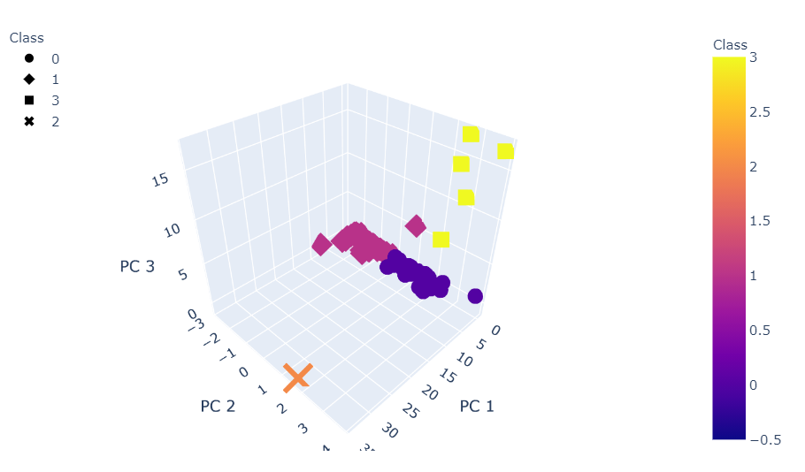

# Cryptocurrencies Market Analysis

The Advisory Services Team at Accountability Accounting, a prominent investment bank, is interested in offering a new cryptocurrency investment portfolio for its customers. They are looking to create a report that includes what cryptocurrencies are on the trading market and how they could be grouped to create a classification system for this new investment. 

The [data](crypto_data.csv) retrieved from [CryptoCompare](https://min-api.cryptocompare.com/data/all/coinlist) is not ideal, so it will need to be processed to fit the machine learning models. Since there is no known output for what Accountability Accounting is looking for, we are going to use unsupervised machine learning. To group the cryptocurrencies, we decided on a clustering algorithm and use data visualizations to share findings with the board.
  
## Processing and Analysis

We first start with data preprocessing by
<li> Choosing the currencies that are trading,
<li> Dropping rows of data where Algorithm is NA,
<li> Dropping the IsTrading column,
<li> Dropping all rows with NA values in any column,
<li> Selecting the rows that have TotalCoinsMined value more than zero,
<li> Separating the CoinName column to a different data set for future use,
<li> Encoding all String columns to numeric by using pandas.get_dummies() function,
<li> Lastly, scaling all the column values using StandardScaler from sklearn.
  
After encoding the string values, we ended up with 98 columns. So PCA  was used to reduce the feature dimensionality. 

 

The biggest drop in variance show with 1 feature. But choosing just 1 feature would be underfitting data. The next variance drop we see is at feature 2. However, the graph shows that from component 2, there is not much drop in the variance dipping only slightly at 8.   With trial and error with different PCA values, 3 PCA components looks ideal for further analysis.  
 

The next step is to identify what would be the ideal number of clusters that we should group the crytocurrencies. Using the Elbow curve, it is determined that ideal number of clusters would be 4. 
 
 

A 3D-Scatter plot with the PCA data and the clusters looks like: 

Further we scale TotalCoinsMined and TotalCoinSupply columns using MinMaxScaler and plot the graph. 

